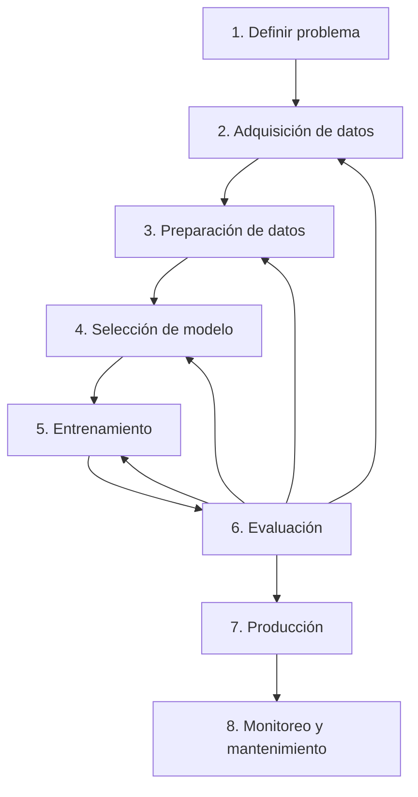

[Curso: Aprendizaje de Máquina](index)

# Ciclo de vida de un proyecto de aprendizaje de máquina  

## 1. Introducción y visión global  

El ciclo de vida de un proyecto de aprendizaje de máquina (ML lifecycle) es la hoja de ruta que guía desde la **definición del problema** hasta el **monitoreo** y **mantenimiento** en producción. Comprenderlo permite planificar con rigor, asignar tiempos, recursos y anticipar riesgos.  



## 2. Etapas en detalle

| Etapa                            | Objetivo principal                                                                             | Salida típica                               |
| -------------------------------- | ---------------------------------------------------------------------------------------------- | ------------------------------------------- |
| **1. Definir problema**          | Traducir la necesidad de negocio en un objetivo cuantificable de ML.                           | Especificaciones: tipo de modelo, métrica   |
| **2. Adquisición de datos**      | Identificar y adquirir las fuentes de datos: bases, APIs, sensores, etc.                       | Datos crudos (raw data)                     |
| **3. Preparación de datos**      | Limpieza, normalización, ingeniería de características (feature engineering).                  | Conjuntos de entrenamiento/prueba           |
| **4. Selección de modelo**       | Elegir familia de algoritmos (regresión, clasificación, clustering…).                          | Modelo(es) candidato(s)                     |
| **5. Entrenamiento**             | Ajustar parámetros del modelo minimizando la función de costo.                                 | Modelo entrenado                            |
| **6. Evaluación**                | Medir desempeño según métricas (MSE, precisión, recall, F1, AUC…).                             | Reporte de métricas                         |
| **7. Producción**                | Integrar el modelo en un sistema para producción: APIs, contenedores, dispositivos embebidos.  | Servicio/endpoint activo                    |
| **8. Monitoreo y mantenimiento** | Supervisar calidad de predicciones, detectar desvíos (drift) y reentrenar según sea necesario. | Manual de operación, pipeline de retraining |

## 3. Herramientas y ecuaciones clave

1. **Representación de datos (Matriz de características)**:

     $$
     \mathbf{X} = 
     \begin{pmatrix}
       x_{11} & x_{12} & \cdots & x_{1p} \\
       x_{21} & x_{22} & \cdots & x_{2p} \\
       \vdots & \vdots & \ddots & \vdots \\
       x_{n1} & x_{n2} & \cdots & x_{np}
     \end{pmatrix},\quad
     \mathbf{y} = 
     \begin{pmatrix}
       y_1 \\ y_2 \\ \vdots \\ y_n
     \end{pmatrix}.
     $$

    Donde:
    - **$n$**: Número de **muestras** u observaciones. Cada fila de $\mathbf{X}$ y cada entrada de $\mathbf{y}$ corresponde a una muestra distinta.  
    - **$p$**: Número de **características** o variables independientes. Cada columna de $\mathbf{X}$ representa una característica distinta.  
    - **$x_{ij}$**: Valor de la **característica** $j$ de la **muestra** $i$. Corresponde al elemento en la fila $i$, columna $j$ de la matriz $\mathbf{X}$.  
    - **$\mathbf{X}$**: Matriz de características de dimensión $n \times p$, que agrupa todos los $x_{ij}$.  
    - **$\mathbf{y}$**: Vector columna de valores **objetivo** de dimensión $n$, donde cada $y_i$ es la respuesta real asociada a la muestra $i$.  

1. **Función de costo en la Regresión lineal (Error cuadrático medio MSE)**:

     $$
     \mathrm{MSE}(\hat{\mathbf{y}}, \mathbf{y}) = \frac{1}{n} \sum_{i=1}^n (y_i - \hat y_i)^2.
     $$

    Donde:
    - **$\hat y_i$**: Valor **predicho** por el modelo para la muestra $i$.  
    - **$\mathrm{MSE}$**: Nombre de la **función de costo** “Error Cuadrático Medio” (Mean Squared Error). Su objetivo es medir el **desajuste promedio** entre las predicciones $\hat y_i$ y los valores reales $y_i$.  


3. **División de conjuntos (Porcentaje típico de split)**:

     $$
     n_{\mathrm{train}} = \lfloor 0.8\,n \rfloor,\quad n_{\mathrm{test}} = n - n_{\mathrm{train}}.
     $$

    Donde:
    - **$n_{\mathrm{train}}$**: Cantidad de muestras en el **conjunto de entrenamiento**, típicamente $\lfloor 0.8\,n\rfloor$.  
    - **$n_{\mathrm{test}}$**: Cantidad de muestras en el **conjunto de prueba**, calculado como $n - n_{\mathrm{train}}$.  


4. **Evaluación (Coeficiente de determinación $R^2$)**

   $$
   R^2 = 1 - \frac{\sum (y_i - \hat y_i)^2}{\sum (y_i - \bar y)^2},\quad 
   \bar y = \frac{1}{n}\sum_{i=1}^n y_i.
   $$

    Donde:
    - **$\bar y$**: **Valor medio** de todas las observaciones de $\mathbf{y}$, calculado como  

    $$
    \bar y = \frac{1}{n}\sum_{i=1}^{n} y_i.
    $$

    - **$R^2$**: Nombre del **coeficiente de determinación**. Su objetivo es cuantificar la proporción de la **varianza** total de $\mathbf{y}$ que explica el modelo:  

    $$
    R^2 = 1 - \frac{\sum_{i=1}^n (y_i - \hat y_i)^2}{\sum_{i=1}^n (y_i - \bar y)^2}.
    $$

6. **Ecuación del modelo de regresión lineal simple**

    $$
    \hat y_i = m \, x_i + b
    $$

    Donde:
    - **$m$**: **Pendiente** del modelo de regresión lineal simple. Representa el cambio esperado en la variable de salida por unidad de cambio en la característica.  
    - **$b$**: **Intercepto** o término independiente de la regresión lineal. Indica el valor predicho cuando todas las características son cero.  

---

## Práctica {#practica}

### Objetivo de la práctica

Reforzar el ciclo de vida de un proyecto de ML mediante la generación, preparación, entrenamiento y evaluación de un modelo de regresión lineal sobre datos sintéticos.

### Explicación del problema

Simularemos el consumo de un sensor de temperatura que sigue una relación lineal con la hora del día (con ruido). Nuestro objetivo es entrenar un modelo que prediga la temperatura según la hora.

### Instrucciones de la práctica

1. **Creamos carpeta de la práctica**: crea la carpeta y cambiate a ella.
    ```bash
    mkdir ml_lifecycle
    cd ml_lifecycle
    ```
1. **Generación de datos**

    Creamos a **data.py**.

    ```bash
    vim data.py
    ```

    ```python
    #!/home/karlos/via/bin/python
    # data.py
    """
    Simula datos de temperatura vs hora del día.
    Etapa de recolección de datos (ver sección 2).
    """
    import numpy as np
    import pandas as pd

    # Parámetros de simulación
    n_samples = 200  # número total de lecturas
    np.random.seed(42)

    # Generamos la característica 'hora' uniforme entre 0 y 23 horas
    hora = np.random.uniform(0, 23, size=n_samples)

    # Relación lineal: temp = 2*h + 10 + ruido gaussiano
    pendiente = 2.0    # coeficiente de la característica
    intercepto = 10.0 # término independiente
    ruido = np.random.normal(0, 3, size=n_samples)

    # Cálculo de la temperatura (etapa de ingeniería de características)
    temperatura = pendiente * hora + intercepto + ruido

    # Creamos DataFrame y guardamos
    df = pd.DataFrame({
        'hora': hora,
        'temperatura': temperatura
    })
    df.to_csv('data.csv', index=False)
    print("CSV generado: data.csv (etapa de recolección de datos)")
    ```

    Ejecutamos a **data.py**.
    ```bash
    python data.py
    ```

1. **Análisis y modelado**

    Creamos a **main.py**.
    ```bash
    vim main.py
    ```

    En **main.py** veremos:

    * Cargar y visualizar los datos.
    * Dividir en entrenamiento 80 % / prueba 20 %.
    * Entrenar un modelo de regresión lineal.
    * Calcular y mostrar MSE y $R^2$.
    * Graficar la línea de regresión vs. datos reales.


    ```python
    #!/home/karlos/via/bin/python
    # main.py
    """
    Ejemplo completo del ciclo de vida de ML:
    - Preparación de datos
    - Selección y entrenamiento de modelo
    - Evaluación de resultados
    """

    import pandas as pd
    import numpy as np
    import matplotlib.pyplot as plt
    from sklearn.linear_model import LinearRegression
    from sklearn.metrics import mean_squared_error, r2_score
    from sklearn.model_selection import train_test_split

    # 1. Carga de datos (etapa de preparación de datos)
    df = pd.read_csv('datos_ml.csv')
    X = df[['hora']].values        # Matriz de características
    y = df['temperatura'].values   # Vector objetivo

    # 2. División en entrenamiento/prueba
    #    n_train = 0.8 * n, n_test = 0.2 * n  (ver ecuación de split)
    X_train, X_test, y_train, y_test = train_test_split(
        X, y, test_size=0.2, random_state=42
    )

    # 3. Selección y entrenamiento del modelo
    #    Regresión lineal simple: temperatura ≈ m*hora + b
    model = LinearRegression()
    model.fit(X_train, y_train)  # minimiza MSE (ver ecuación de costo)

    # Coeficientes entrenados
    m = model.coef_[0]      # pendiente
    b = model.intercept_    # intercepto
    print(f"Modelo entrenado: temp = {m:.3f} * hora + {b:.3f}")

    # 4. Evaluación
    y_pred = model.predict(X_test)
    mse = mean_squared_error(y_test, y_pred)   # MSE = 1/n Σ(y - ŷ)²
    r2 = r2_score(y_test, y_pred)             # R² = 1 – SSE/SST

    print(f"MSE (Error cuadrático medio): {mse:.3f}")
    print(f"R² (Coeficiente de determinación): {r2:.3f}")

    # 5. Gráfico de resultados (opcional para visualización)
    plt.figure(figsize=(8,5))
    plt.scatter(X_test, y_test, label='Datos reales')
    plt.plot(X_test, y_pred, color='orange', label='Línea ajustada')
    plt.title('Regresión Lineal: Temperatura vs Hora')
    plt.xlabel('Hora del día')
    plt.ylabel('Temperatura (°C)')
    plt.legend()
    plt.grid(True)
    plt.show()

    # Comentarios:
    # - La ecuación de costo minimizada fue MSE (sección 3).
    # - R² cercano a 1 indica buen ajuste (sección 3).
    # - En producción, pasaríamos a despliegue y monitoreo (etapas 7 y 8).
    ```

    Ejecutamos a **main.py**.
    ```bash
    python main.py
    ```
