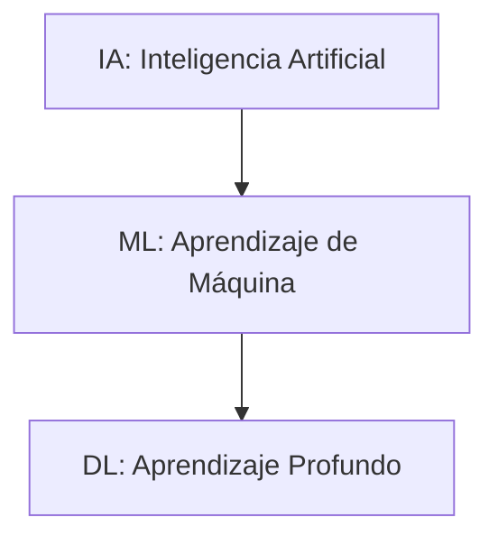

[Curso: Aprendizaje de Máquina](index)

# Diferencias entre inteligencia artificial (AI), aprendizaje de máquina (ML) y aprendizaje profundo (DL)

La **Inteligencia Artificial (IA)** es una rama de la informática que se enfoca en crear sistemas capaces de realizar tareas que normalmente requieren inteligencia humana, como el razonamiento, la percepción, el procesamiento del lenguaje natural o la toma de decisiones.
> **IA = Sistema que emula comportamientos inteligentes.**

El **aprendizaje de máquina (ML)** es un subconjunto de la IA que permite a las máquinas aprender a partir de datos, identificar patrones y tomar decisiones sin ser explícitamente programadas para cada tarea específica.
> **ML = Sistemas que aprenden patrones a partir de datos.**

El **aprendizaje profundo (DL)** es una subcategoría del aprendizaje de máquina que utiliza redes neuronales profundas para aprender representaciones de datos jerárquicas. Es particularmente eficaz en el procesamiento de imágenes, sonido y lenguaje.
> **DL = ML + Redes Neuronales Profundas.**




| Característica            | IA                       | ML                                   | DL                                  |
| ------------------------- | ------------------------ | ------------------------------------ | ----------------------------------- |
| Definición                | Sistemas inteligentes    | Algoritmos que aprenden de datos     | Redes neuronales profundas          |
| Inspiración       | Comportamiento humano | Estadística, optimización        | Neurociencia, córtex visual      |
| Requiere datos            | No necesariamente        | Sí                                   | Gran cantidad de datos              |
| Ejemplo                   | Agente que juega ajedrez | Modelo que predice consumo eléctrico | Red neuronal que clasifica imágenes |
| Complejidad computacional | Variable                 | Moderada                             | Alta                                |

### Ecuaciones relevantes

Hipótesis del Aprendizaje de Máquina:

$$
\hat{y} = f(x)
$$

Donde:
- $\hat{y}$ predicción.
- $x$ entrada
- $f$ función para aproximar

Red Neuronal (simplificada):

$$
\hat{y} = \sigma(Wx + b)
$$

Donde:
- $\hat{y}$ predicción.
- $x$ entrada
- $W$: pesos
- $b$: sesgo (bias)
- $\sigma$: función de activación

---

## Práctica

### Objetivo

Que el estudiante entienda de forma aplicada las diferencias entre un modelo tradicional basado en reglas fijas (RF), uno basado en aprendizaje de máquina (ML) y uno basado en redes neuronales (DL) mediante la predicción de "riesgo de sobrecalentamiento" en motores.

### Problema

Simular tres enfoques para predecir si un motor está en riesgo de sobrecalentamiento:

1. **RF**: reglas fijas basadas en umbrales.
2. **ML**: modelo entrenado con regresión logística.
3. **DL**: red neuronal simple.

### Instrucciones

1. Ejecutar el script generador de datos.
2. Analizar los datos generados.
3. Entrenar y comparar los modelos RF (reglas), ML (LogisticRegression), y DL (MLPClassifier).

Script generador de datos **generador_datos.py**.

```python
import pandas as pd
import numpy as np

np.random.seed(0)
n = 200
temp = np.random.normal(70, 10, n)  # temperatura
vel = np.random.normal(1500, 300, n)  # velocidad RPM
vib = np.random.normal(0.5, 0.1, n)  # vibración (g)

# Riesgo de sobrecalentamiento (etiqueta): 1 si temp > 85 o vib > 0.65
riesgo = ((temp > 85) | (vib > 0.65)).astype(int)

# Crear DataFrame
df = pd.DataFrame({"Temperatura": temp, "Velocidad": vel, "Vibracion": vib, "Riesgo": riesgo})
df.to_csv("datos_motor.csv", index=False)
print("Archivo 'datos_motor.csv' generado.")
```

Script: Comparación de modelos IA, ML y DL **comparacion_ai_ml_dl.py**.

```python
import pandas as pd
from sklearn.linear_model import LogisticRegression
from sklearn.neural_network import MLPClassifier
from sklearn.metrics import classification_report

# Cargar datos
df = pd.read_csv("datos_motor.csv")
X = df[["Temperatura", "Velocidad", "Vibracion"]]
y = df["Riesgo"]

# --- Modelo RF (reglas fijas) ---
def reglas_ia(row):
    return int(row["Temperatura"] > 85 or row["Vibracion"] > 0.65)

df["IA"] = df.apply(reglas_ia, axis=1)

# --- Modelo ML (regresión logística) ---
ml_model = LogisticRegression()
ml_model.fit(X, y)
df["ML"] = ml_model.predict(X)

# --- Modelo DL (Red Neuronal Multicapa) ---
dl_model = MLPClassifier(hidden_layer_sizes=(5,), max_iter=1000)
dl_model.fit(X, y)
df["DL"] = dl_model.predict(X)

# --- Evaluación ---
print("Evaluación ML:")
print(classification_report(y, df["ML"]))

print("Evaluación DL:")
print(classification_report(y, df["DL"]))

print("Evaluación IA:")
print(classification_report(y, df["IA"]))
```

> **Comentario en el código**:
>
> * La función `reglas_ia` representa un sistema experto basado en umbrales, característico de sistemas de IA clásicos.
> * `LogisticRegression` es un modelo de ML supervisado que ajusta una función $\hat{y} = \sigma(Wx + b)$.
> * `MLPClassifier` usa una red neuronal simple para ajustar múltiples capas, ilustrando el concepto de aprendizaje profundo.

