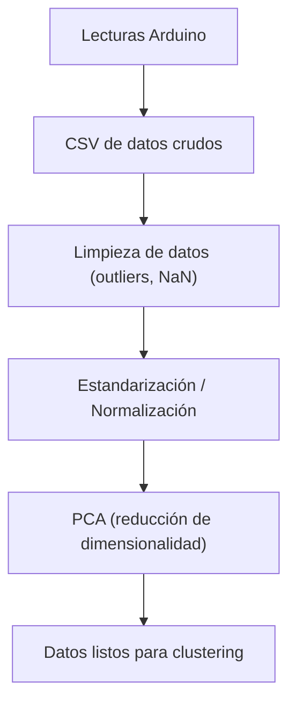

[Curso: Inteligencia Artificial](index)


# Preparación de Datos para Clustering y Reducción de Dimensionalidad

## Objetivo**

Que los estudiantes comprendan y apliquen las etapas de **preprocesamiento y reducción de dimensionalidad** (escalado, normalización, PCA) para preparar datos de sensores antes de realizar técnicas de **clustering**, utilizando Python y sensores conectados a Arduino.

## Aportación a los Atributos de Egreso**

Durante esta actividad los estudiantes aplicarán los **Atributos de Egreso 2 y 7, nivel avanzado (AE2A y AE7A)**.
El **AE2A** se fortalece al diseñar e implementar un sistema embebido que obtiene y prepara datos reales de sensores para análisis inteligente. El **AE7A** se desarrolla mediante el trabajo colaborativo en equipos, la coordinación para recolectar datos coherentes y la discusión sobre cómo los distintos sensores afectan el resultado del modelo.

## Método de enseñanza

Se empleará el **Aprendizaje Experiencial** combinado con **Aprendizaje Colaborativo**.
Los estudiantes experimentarán directamente el flujo de preparación de datos usando lecturas de sensores reales, discutirán en equipos las estrategias de limpieza y normalización, y aplicarán PCA para visualizar la reducción de dimensionalidad antes del clustering.

## Criterios de evaluación**

| Criterio                                       | Descripción                                                           | Puntaje |
| ---------------------------------------------- | --------------------------------------------------------------------- | ------- |
| Participación activa en clase                  | Contribuye en el desarrollo del circuito y el análisis en Python      | 20%     |
| Implementación del código                      | Logra recolectar, limpiar y normalizar los datos correctamente        | 40%     |
| Interpretación de resultados                   | Explica adecuadamente la gráfica PCA o la tabla de datos normalizados | 20%     |
| Evidencias y documentación breve (Google Docs) | Código + capturas + breve reflexión                                   | 20%     |

## Desarrollo del tema

### Normalización y estandarización de datos

**Estandarización Z-score:** nos permite hacer que las variables tengan la misma escala antes de aplicar clustering o Análisis de Componentes Principales (Principal Component Analysis, PCA).

$$
z_i = \frac{x_i - \mu}{\sigma}
$$

* $x_i$: valor de la observación
* $\mu$: media
* $\sigma$: desviación estándar

#### Ejercicio. Normalización de lecturas**
Un Arduino Nano obtiene lecturas del sensor **LM35** (°C) y del **HC-SR04** (cm). Las escalas son muy diferentes (temperatura: 0–50, distancia: 2–400). Sin estandarizar, el sensor de distancia dominaría el clustering. Con Z-score, ambas contribuyen de forma equivalente.

```python
import pandas as pd
from sklearn.preprocessing import StandardScaler

# Cargar lecturas desde CSV generado por Arduino
# df = pd.read_csv("lecturas_sensores.csv") # Esta función aún no la hemos utilizado, consulta la documentacion de pandas

scaler = StandardScaler()
X_scaled = scaler.fit_transform(df[["temp_lm35", "dist_hcsr04"]])
print(X_scaled[:5])
```

### Detección y eliminación de ruido (outliers)

**Método común:** se eliminan lecturas cuya distancia estándar sea mayor a 3 (posibles errores).

$$
|z_i| > 3
$$


#### Ejercicio. Filtrado de outliers
Si el **HC-SR04** devuelve 999 cm por una lectura errónea, al detectarse un (|z_i| > 3) se elimina automáticamente del dataset antes del clustering.

```python
# Calcular Z-scores sobre datos crudos
z = (X - X.mean(axis=0)) / X.std(axis=0)

# Filtrar outliers
mask = (abs(z) < 3).all(axis=1)
X_clean = X[mask]
```

### Reducción de dimensionalidad

**PCA: Análisis de Componentes Principales:** encontrar combinaciones lineales de las variables que expliquen la mayor varianza.

$$
Z = XW
$$

Donde:

* $X$ es la matriz de datos normalizados
* $W$ son los autovectores de la matriz de covarianza
* $Z$ es la proyección en el nuevo espacio de menor dimensión

#### Ejercicio. Aplicación de PCA
Si un sistema recolecta **luz (LDR)**, **temperatura (LM35)** y **sonido (KY-037)**, el PCA puede proyectarlas en 2D para visualizar en un plano cómo se agrupan las condiciones ambientales.

```python
from sklearn.decomposition import PCA
import matplotlib.pyplot as plt

# Aplicar PCA a los datos normalizados
pca = PCA(n_components=2)
X_pca = pca.fit_transform(X_scaled)

plt.scatter(X_pca[:,0], X_pca[:,1])
plt.title("Proyección PCA de lecturas de sensores")
plt.xlabel("Componente 1")
plt.ylabel("Componente 2")
plt.show()
```

Diagrama: flujo de preparación de datos



Circuito sugerido

1. **Arduino Nano**
2. **LM35:** A0
3. **HC-SR04:** Trig D2, Echo D3
4. **LED** (para indicar proceso de lectura)

## Práctica

En parejas, recolecten 50 lecturas simultáneas de **temperatura (LM35)**, **luz (LDR)** y **sonido (KY-037)**, envíenlas por serial y guárdenlas en un CSV. Luego:

1. Estandaricen los datos.
2. Apliquen PCA con 2 componentes.
3. Grafiquen el resultado.
4. Coloquen una breve reflexión: ¿qué patrón observan entre las condiciones ambientales?

Script guía:

```python
"""
Práctica PCA: Lecturas desde Arduino
"""
import pandas as pd
from sklearn.preprocessing import StandardScaler
from sklearn.decomposition import PCA
import matplotlib.pyplot as plt

# 1. Leer CSV generado por Arduino
# df = pd.read_csv("lecturas_ambiente.csv")

# 2. Estandarizar
# scaler = StandardScaler()
# X_scaled = scaler.fit_transform(df[["temp", "luz", "sonido"]])

# 3. PCA
# pca = PCA(n_components=2)
# X_pca = pca.fit_transform(X_scaled)

# 4. Graficar componentes
# plt.scatter(...)
# plt.title("Proyección PCA de ambiente")
# plt.show()

# TODO: Escriban una reflexión breve sobre qué representa cada eje PCA
```

---

## Entregables

* Un documento (Google Docs o PDF) con:

  1. Capturas del circuito y la ejecución de los ejercicios.
  2. Código Python (con comentarios y resultados).
  3. Reflexión de la práctica PCA (3–5 líneas).

---

## Actividad de gamificación (5–10 minutos)

**Título:** “¿Qué sensor soy?”
**Dinámica:**

1. En equipos, un integrante recibe una tarjeta con el nombre de un sensor (**HC-SR04**, **LDR**, **KY-037**, etc.) y su tipo de dato (analógico/digital).
2. Los demás deben adivinar el sensor haciendo **solo preguntas sobre el tipo de datos y su rango** (ej. “¿Tus valores cambian con la luz?”, “¿Trabajas con sonido?”).
3. Gana el equipo que adivine más sensores en 5 minutos.

**Objetivo:** reforzar la comprensión de las variables del dataset y su importancia en el preprocesamiento.

