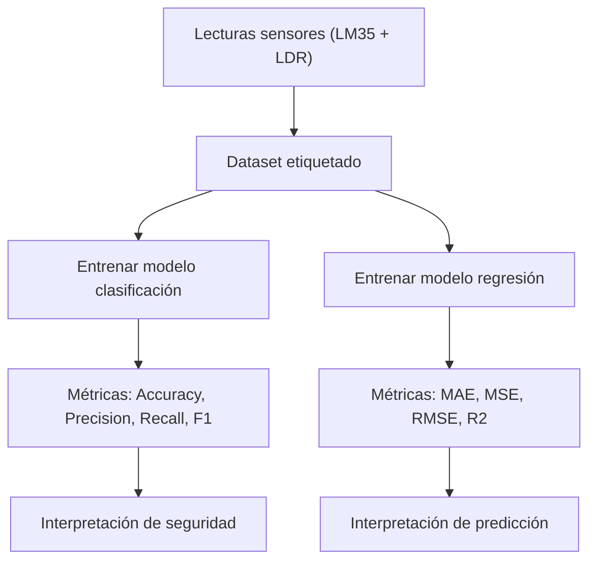

[Curso: Inteligencia Artificial](index)

# Evaluación de Modelos: Métricas de evaluación para clasificación y regresión

## Objetivo

Que los estudiantes comprendan y apliquen las métricas fundamentales para evaluar modelos de **clasificación (accuracy, precision, recall, F1-score)** y **regresión (MAE, MSE, RMSE, R²)** usando datos obtenidos desde un circuito físico con Arduino Nano y sensores reales. Al final, serán capaces de interpretar cómo estas métricas orientan la selección del mejor modelo para aplicaciones mecatrónicas.

## Aportación a los Atributos de Egreso

La actividad contribuye al **Atributo de Egreso 2 Nivel Avanzado (AE2A)** al permitir que los estudiantes **diseñen e implementen un sistema embebido funcional** para generar datos reales y usarlos para evaluar modelos de IA.
Asimismo, fortalece el **Atributo de Egreso 7 Nivel Avanzado (AE7A)** porque requiere **trabajo colaborativo**, planeación y discusión en equipo para analizar qué métricas usar y cómo interpretar sus resultados.

## Método de enseñanza

Se empleará una combinación de:

* **Aprendizaje Experiencial** (los estudiantes construyen y miden con un circuito real)
* **Aprendizaje Colaborativo** (equipos discuten métricas y resultados)
* **Gamificación** (actividad final de 5–10 minutos)


## Criterios de evaluación

| Criterio                                                        | Descripción                                             | Puntaje |
| --------------------------------------------------------------- | ------------------------------------------------------- | ------- |
| Participación activa en la construcción y medición del circuito | Armado, mediciones y trabajo en equipo                  | 20%     |
| Implementación de scripts en Arduino/Python                     | Recolección de datos + evaluación del modelo            | 40%     |
| Interpretación de métricas                                      | Explica correctamente qué métrica usar y por qué        | 20%     |
| Entregables (Google Docs con capturas y código)                 | Evidencias claras, sin necesidad de formalidad excesiva | 20%     |

---

# Desarrollo del tema

## 1. Aplicación ejemplo

**Aplicación: Sistema de clasificación y predicción para monitorear un corredor industrial automatizado.**
Los estudiantes simularán una banda transportadora donde un Arduino Nano detecta **nivel de luz (LDR)** y **temperatura (LM35)** para predecir dos cosas:

1. **Clasificación:** Determinar si el ambiente está en *condición normal* o *condición crítica* (por ejemplo, sobrecalentamiento o falta de iluminación).
2. **Regresión:** Predecir el valor futuro de la temperatura a corto plazo (1–2 segundos adelante).

El circuito será el mismo durante toda la clase y permitirá generar datasets reales para evaluar modelos de clasificación y regresión con las métricas vistas. Esta aplicación mecatrónica es suficiente para explicar todas las métricas planteadas, comparando condiciones “normal” vs. “crítica” y realizando predicciones numéricas de temperatura.

**Circuito (simple):**

* Arduino Nano
* **LM35** → A0
* **LDR** + resistencia 10 kΩ → A1
* **LED rojo** (alerta) → D4
* **Buzzer** → D5

Sensores usados del repositorio: LM35, LDR; actuadores: LED y buzzer.


---

## 2. Conceptos

### 2.1 Métricas de clasificación

### Accuracy (Exactitud)

Cantidad de predicciones correctas entre el total:

$$
Accuracy = \frac{TP + TN}{TP + TN + FP + FN}
$$

* $TP$: Verdaderos Positivos
* $TN$: Verdaderos Negativos
* $FP$: Falsos Positivos
* $FN$: Falsos Negativos

**Relación con la aplicación:**
Si clasificamos “condición crítica”, accuracy indica qué tan bien clasifica el sistema en general, pero puede ser engañoso si la clase crítica es rara.

---

### Precisión

Indica qué porcentaje de las predicciones “críticas” realmente lo eran:

$$
Precision = \frac{TP}{TP + FP}
$$

**Relación con la aplicación:**
Si el LED rojo y el buzzer se activan por falsos positivos, la precisión baja y generamos alarmas inútiles.

---

### Recall (Sensibilidad)

Porcentaje de casos realmente críticos que el modelo detecta:

$$
Recall = \frac{TP}{TP + FN}
$$

**Relación con la aplicación:**
Importante para seguridad: un *FN* implica que el sistema no detectó una condición peligrosa.

---

### F1-score

Promedio armónico entre precisión y recall:

$$
F1 = 2 \cdot \frac{Precision \cdot Recall}{Precision + Recall}
$$

**Relación con la aplicación:**
Equilibra precisión y recall para sistemas que deben evitar alarmas falsas pero también evitar omitir riesgos reales.

---

### Tabla resumen

| Métrica   | ¿Qué mide?                    | Riesgo si es baja                        | Relación con el circuito                       |
| --------- | ----------------------------- | ---------------------------------------- | ---------------------------------------------- |
| Accuracy  | % de aciertos                 | Modelo engañoso si clases desbalanceadas | Podría parecer bueno aunque falle en “crítico” |
| Precisión | Alarmas reales vs falsas      | Alarmas innecesarias                     | LED/Buzzer activan sin razón                   |
| Recall    | Detectar condiciones críticas | Riesgo real no detectado                 | Peligro ignorado                               |
| F1        | Equilibrio P-R                | No optimiza seguridad y confiabilidad    | Indicador global                               |

---

### 2.2 Métricas de regresión

### MAE — Error absoluto medio

$$
MAE = \frac{1}{n}\sum_{i=1}^{n} |y_i - \hat{y}_i|
$$

**Relación:**
Indica cuántos °C se equivoca en promedio el modelo que predice temperatura.

---

### MSE — Error cuadrático medio

$$
MSE = \frac{1}{n}\sum_{i=1}^{n} (y_i - \hat{y}_i)^2
$$

Penaliza más los errores grandes.

**Relación:**
Especialmente relevante cuando cambios grandes de temperatura son riesgosos.

---

### RMSE — Raíz del MSE

$$
RMSE = \sqrt{MSE}
$$

**Relación:**
Permite interpretar el error en las mismas unidades (°C).

---

### $R^2$ — Coeficiente de determinación

$$
R^2 = 1 - \frac{\sum (y_i - \hat{y}_i)^2}{\sum (y_i - \bar{y})^2}
$$

**Relación:**
Qué tanto explica el modelo la variabilidad de temperatura del sistema físico.

---

### Diagrama de relación de métricas



---

## 3. Ejercicio Integrador

### Actividad

Los estudiantes usarán el circuito armado para recolectar:

* 50 lecturas “normales”
* 50 lecturas simulando “condición crítica” (se puede tapar la LDR, calentar el LM35 con la mano o una fuente leve de calor)

Luego evaluarán un modelo de clasificación y otro de regresión con las métricas vistas.

---

### Código Arduino

```cpp
/*
  Recolección de datos para clasificación y regresión
  Sensores: LM35 (A0), LDR (A1)
*/

void setup() {
  Serial.begin(9600);
  pinMode(A0, INPUT);
  pinMode(A1, INPUT);
  // pinMode(4, OUTPUT); // LED
  // pinMode(5, OUTPUT); // buzzer
}

void loop() {
  int rawTemp = analogRead(A0);
  int rawLight = analogRead(A1);

  // Convertir LM35 a °C (pseudocódigo)
  // float tempC = (rawTemp *5.0/1023.0)*100;

  // Lecturas crudas para el CSV
  Serial.print(rawTemp);
  Serial.print(",");
  Serial.println(rawLight);

  // delay(...)  --> pseudocódigo
}
```

---

### Código Python

```python
"""
Evaluación de modelos: clasificación y regresión
"""

import pandas as pd
from sklearn.model_selection import train_test_split
from sklearn.metrics import accuracy_score, precision_score, recall_score, f1_score
from sklearn.metrics import mean_absolute_error, mean_squared_error, r2_score
from sklearn.linear_model import LogisticRegression, LinearRegression

# 1. Leer CSV generado por Arduino
# df = pd.read_csv("lecturas_clase.csv")

# 2. Etiquetas para clasificación (pseudocódigo)
# df["label"] = df["temp"].apply(lambda x: 1 si es crítico else 0)

# 3. Entrenar modelos
# X = df[["temp", "luz"]]
# y_class = df["label"]
# y_reg = df["temp_futuro"]  # pseudocódigo

# X_train, X_test, y_train, y_test = train_test_split(...)

# modelo_clf = LogisticRegression()
# modelo_clf.fit(X_train, y_train)
# pred_clf = modelo_clf.predict(X_test)

# 4. Métricas de clasificación
# acc = accuracy_score(...)
# prec = precision_score(...)
# rec = recall_score(...)
# f1 = f1_score(...)

# 5. Modelo de regresión
# modelo_reg = LinearRegression()
# modelo_reg.fit(X_train, y_reg_train)
# pred_reg = modelo_reg.predict(X_test)

# 6. Métricas de regresión
# mae = mean_absolute_error(...)
# mse = mean_squared_error(...)
# rmse = mse**0.5
# r2 = r2_score(...)

print("Completa el script con tus datos y cálculos.")
```

---

# Entregables

Un **Google Docs** con:

1. Foto del circuito.
2. Capturas del CSV y del código en Arduino.
3. Scripts Python ejecutados.
4. Tabla final de métricas (sin formato especial).
5. Breve reflexión (5 líneas): ¿qué métrica te permitió evaluar mejor el sistema y por qué?

No requiero diagramas complejos ni reportes extensos.

---

# Actividad de gamificación (5–10 minutos)

### **Título:** “Metric Battle Royale”

### Dinámica

1. Formar equipos de 3–4 estudiantes.
2. Cada equipo recibe tarjetas con nombres de métricas (Accuracy, Recall, F1, MAE, RMSE, R²).
3. En cada ronda, proyectaré una **situación rápida** de clasificación o regresión en el pizarrón.
4. En **10 segundos**, cada equipo debe levantar la tarjeta con **la métrica más adecuada** para evaluar ese caso.
5. Se otorga 1 punto por acierto.
6. Gana el equipo con más puntos.

### Ejemplos de situaciones

* “Modelo que detecta fallas raras en un robot” → Recall
* “Modelo que predice voltaje futuro del sistema” → RMSE
* “Modelo desbalanceado con clase crítica rara” → F1

**Objetivo:** despertar, competir, reír un poco y reforzar el significado real de cada métrica.
