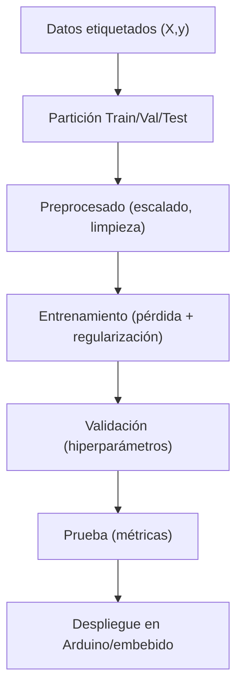

[Curso: Aprendizaje de Máquina](index)

# Concepto y aplicaciones

## Objetivo de la actividad

Que los estudiantes comprendan el funcionamiento del aprendizaje supervisado a través del modelo de **Regresión Logística Multiclase**, aplicándolo a un caso de un robot seguidor de pared con sensores ultrasónicos, y reflexionen sobre el impacto de la regularización y la evaluación del desempeño del modelo.

## Atributos de egreso trabajados

* **Atributo de Egreso 2, Nivel Avanzado:** Diseñar e implementar sistemas en el área de automatización, control, robótica y sistemas embebidos, a través de proyectos integradores.  
* **Atributo de Egreso 7, Nivel Avanzado:** Favorecer el trabajo colaborativo y el liderazgo, integrándose en equipos multidisciplinarios para establecer metas, planear tareas, cumplir fechas límite y analizar riesgos e incertidumbre.

## Método de enseñanza

Se utilizará el **Aprendizaje Experiencial** y el **Aprendizaje Colaborativo**:contentReference[oaicite:3]{index=3}.  
Durante la explicación teórica, los estudiantes completarán una actividad guiada que refuerce los conceptos, y posteriormente desarrollarán una práctica aplicada en equipos.

## Fases de la Actividad

### Fase 1. Comprensión Teórica Guiada (40 minutos)

#### Dinámica

Mientras el profesor explica la teoría los estudiantes irán describiendo en un documento con su palabras 5 conceptos que considere importantes.

#### Entregable (en pareja)

5 conceptos con explicación en sus propias palabras

### Fase 2. Práctica (40 minutos)

#### Dinámica

En equipos, los estudiantes usarán el archivo `sensor_readings_4.csv` del dataset *Wall-Following Robot*. 
Implementarán un modelo de **Regresión Logística Multiclase** con Python (script provisto por el profesor), entrenarán el modelo y analizarán la **matriz de confusión**.  

#### Entregable (en pareja)

Un **informe breve (máx. 1 página)** que incluya:
1. Accuracy obtenido en el conjunto de prueba.  
1. Matriz de confusión interpretada (qué errores son más graves para el robot).  
1. Una reflexión sobre el papel de la regularización.

---

## Teoría

### ¿Qué es el aprendizaje supervisado?

El aprendizaje supervisado es un enfoque de IA donde un **modelo** aprende una función $f: \mathbb{R}^d \to \mathcal{Y}$ a partir de **pares** $(\mathbf{x}_i, y_i)$ etiquetados. El objetivo es **predecir** la etiqueta $y$ para una nueva entrada $\mathbf{x}$ minimizando el error de predicción.

**Ejemplo:**
Un Arduino Nano recibe lecturas del sensor **HC-SR04** (distancia), **DHT22** (temperatura/humedad) y una **LDR** (luz). Con ejemplos etiquetados “**obstáculo cercano**” vs “**libre**”, entrenas un clasificador que, dado el vector de sensores, decide si **detener** un motor DC mediante un **relevador** o **continuar**. El sistema aprende la relación “patrón de sensores con la acción de control”.

### Conjuntos de datos: entrenamiento, validación y prueba

Dividimos los datos en tres subconjuntos:

* **Entrenamiento:** ajusta los parámetros del modelo.
* **Validación:** ajusta hiperparámetros y evita sobreajuste.
* **Prueba:** estima el desempeño final en datos no vistos.

**Ejemplo:**
Con 1000 lecturas de un robot seguidor de pared (ultrasonidos alrededor del chasis), usas 70% para **entrenar** (ajustar el modelo), 15% para **validar** y 15% para **probar** el rendimiento real en campo. Así estimas si tu robot, ya en el taller, decidirá bien cuándo girar el **servo** frontal o frenar el **motor**.

### Función de pérdida y Empirical Risk Minimization (ERM)

* **Objetivo:** encontrar la $\theta$ que mejor “explique” las etiquetas observadas.

Buscamos parámetros $\theta$ que minimicen el **riesgo empírico**:

$$
\min_{\theta}\ \hat{R}(\theta)=\frac{1}{n}\sum_{i=1}^{n}\ \mathcal{L}\big(f_{\theta}(\mathbf{x}_i), y_i\big)
$$

* $\theta$: parámetros del modelo
* $\mathcal{L}$: función de pérdida (ej. entropía cruzada en clasificación; MSE en regresión)

**Ejemplo:**
Si predices “**girar izquierda/derecha**” para un robot con **24 ultrasonidos**, la pérdida penaliza cada decisión incorrecta. Entrenas minimizando ese promedio de errores. En la línea, el resultado práctico es que el **servo** de dirección se posiciona con menos fallos al detectar paredes, logrando que el robot siga la pared con menor oscilación.

### Pérdidas típicas

#### Regresión MSE

**Objetivo:** minimizar el error cuadrático medio entre valor real y predicho.

$$
\mathcal{L}_{\text{MSE}} = \frac{1}{n}\sum_{i=1}^n \big(y_i - \hat{y}_i\big)^2
$$

#### Clasificación (entropía cruzada)

**Objetivo:** maximizar la probabilidad de la clase correcta. [Más información](entropia_cruzada).

$$
\mathcal{L}_{\text{CE}} = -\sum_{c=1}^{C} \mathbf{1}[y=c]\ \log p_{\theta}(y=c\mid \mathbf{x})
$$


**Ejemplo:**
Para **clasificar** “libre/obstáculo”, usas entropía cruzada, empujando al modelo a predecir probabilidades altas para la clase correcta. Para **estimar** distancia con un **HC-SR04** calibrado, usas MSE, ajustando un modelo que acerque lo predicho a la distancia real para que el **servo** de dirección anticipe giros suaves.


### Regularización y sobreajuste

**Objetivo:** controlar la complejidad del modelo y mejorar generalización. [Más información](regularizacion_l2)

Para evitar sobreajuste, añadimos **penalizaciones** a los parámetros. Regularización L2 (Ridge):

$$
\min_{\theta}\ \hat{R}(\theta) + \lambda\ \lVert \theta \rVert_2^2
$$

**Ejemplo:**
Un modelo muy complejo aprende “ruido” de tus sensores (picos de **ruido eléctrico** al encender una **bomba** vía relevador). Con **L2** reduces pesos extremos y logras decisiones más estables del **motor**. Así, el robot no gira por una **lectura espuria** de un ultrasonido, sino por **patrones** consistentes.


### Algoritmos clásicos en supervisado

#### Regresión logística

Modela la probabilidad de clase mediante una frontera lineal.

$$
p(y=1\mid \mathbf{x})=\sigma(\mathbf{w}^\top\mathbf{x}+b)=\frac{1}{1+e^{-(\mathbf{w}^\top\mathbf{x}+b)}}.
$$


#### k Nearest Neighbor k-NN

Etiqueta según las $k$ muestras más cercanas (distancia Euclídea). Aprovechar la “vecindad” en el espacio de características.

#### Support Vector Machine SVM

Maximiza el **margen** entre clases con hiperplanos. Es más robusto en separaciones difíciles; kernels para no linealidad.

$$
\min_{\mathbf{w},b}\ \frac{1}{2}\lVert \mathbf{w}\rVert^2 + C\sum_i \xi_i\quad 
\text{s.a. } y_i(\mathbf{w}^\top\mathbf{x}_i+b)\ge 1-\xi_i.
$$


#### Árboles/Random Forest

Particionan el espacio por reglas. Capturar interacciones no lineales y ser interpretables.

**Ejemplo:**
Con **k-NN**, tu robot compara la lectura actual de los **24 ultrasónicos** contra su **historial** y elige la clase mayoritaria de los k “más parecidos”. Con **SVM**, aprendes una **frontera** que separa “seguir recto” vs “girar”. Con **Random Forest**, combinas muchos **árboles** que votan la acción del **servo**.

### Diagrama del flujo supervisado 



---

## 2) Práctica

## Objetivo

Entrenar un **modelo de regresión logística** para clasificar las acciones de un robot seguidor de pared (recto, girar izquierda, girar derecha) usando el dataset *Wall-Following Robot* (`sensor_readings_4.csv`, para no abrumar con 24 sensores).

* Dataset: [Wall-following Robot](https://www.kaggle.com/datasets/uciml/wall-following-robot?resource=download)


## Problema

El robot cuenta con 4 sensores ultrasónicos que miden distancias alrededor del chasis.
A partir de estas lecturas debe decidir si **avanza recto**, **gira a la izquierda** o **gira a la derecha**.

Con un modelo de **regresión logística multiclase (softmax)** entrenaremos un clasificador para tomar esta decisión.


## Instrucciones

1. Usa el archivo `sensor_readings_4.csv`.
2. Identifica la columna de etiquetas (clase).
3. Divide datos en entrenamiento (70%) y prueba (30%).
4. Entrena un modelo de regresión logística con regularización L2.
5. Evalúa con **accuracy** y **matriz de confusión**.
6. Reflexiona: ¿qué tipo de errores serían más graves para el robot?


## Script

```python
# -*- coding: utf-8 -*-
"""
Práctica: Regresión Logística Multiclase con sensor_readings_4.csv
Curso: Ingeniería Mecatrónica 7° semestre

Conceptos clave:
- Aprendizaje supervisado: usamos pares (X, y) para entrenar.
- Regresión logística (multiclase con softmax).
- Entropía cruzada: pérdida que penaliza predicciones incorrectas.
- Regularización L2: evita que los pesos crezcan demasiado.
"""

import pandas as pd
from pathlib import Path
from sklearn.model_selection import train_test_split
from sklearn.preprocessing import StandardScaler
from sklearn.linear_model import LogisticRegression
from sklearn.metrics import accuracy_score, confusion_matrix, classification_report

# -----------------------------
# 1) Cargar dataset
# -----------------------------
CSV_FILE = "sensor_readings_4.csv"
assert Path(CSV_FILE).exists(), f"Coloca {CSV_FILE} en el directorio de trabajo"
df = pd.read_csv(CSV_FILE)

# Identificar etiqueta (puede llamarse 'Class' o similar)
y_col = [c for c in df.columns if c.lower() in ["class","label","target"]][0]
X = df.drop(columns=[y_col]).values
y = df[y_col].values

print("Clases disponibles:", set(y))

# -----------------------------
# 2) Dividir datos
# -----------------------------
X_train, X_test, y_train, y_test = train_test_split(
    X, y, test_size=0.3, stratify=y, random_state=42
)

# -----------------------------
# 3) Escalar y entrenar modelo
# -----------------------------
scaler = StandardScaler()
X_train = scaler.fit_transform(X_train)
X_test = scaler.transform(X_test)

# -----------------------------
# 4) Entrenar modelo
# -----------------------------
# Regresión logística multinomial (softmax)
# C = 1/λ controla la regularización L2
clf = LogisticRegression(multi_class="multinomial", solver="lbfgs", C=1.0, max_iter=300)
clf.fit(X_train, y_train)

# -----------------------------
# 4) Evaluar modelo
# -----------------------------
y_pred = clf.predict(X_test)

print("Accuracy en test:", accuracy_score(y_test, y_pred))
print("\nReporte de clasificación:\n", classification_report(y_test, y_pred))
print("\nMatriz de confusión:\n", confusion_matrix(y_test, y_pred))

# -----------------------------
# 5) Reflexión
# -----------------------------
# - ¿Qué clases confunde más el modelo?
# - Si confunde "seguir recto" con "girar", ¿qué implica físicamente?
# - ¿Aumentarías λ (es decir, reducir C) para estabilizar los pesos?
```

