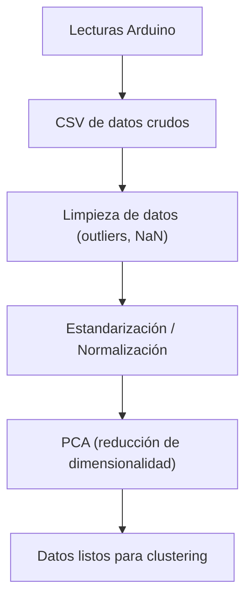

[Inicio](/curso/ia)

# Preparación de Datos para Clustering y Reducción de Dimensionalidad

## Objetivo**

Que los estudiantes comprendan y apliquen las etapas de **preprocesamiento y reducción de dimensionalidad** (escalado, normalización, PCA) para preparar datos de sensores antes de realizar técnicas de **clustering**, utilizando Python y sensores conectados a Arduino.

## Aportación a los Atributos de Egreso**

Durante esta actividad los estudiantes aplicarán los **Atributos de Egreso 2 y 7, nivel avanzado (AE2A y AE7A)**.
El **AE2A** se fortalece al diseñar e implementar un sistema embebido que obtiene y prepara datos reales de sensores para análisis inteligente. El **AE7A** se desarrolla mediante el trabajo colaborativo en equipos, la coordinación para recolectar datos coherentes y la discusión sobre cómo los distintos sensores afectan el resultado del modelo.

## Método de enseñanza

Se empleará el **Aprendizaje Experiencial** combinado con **Aprendizaje Colaborativo**.
Los estudiantes experimentarán directamente el flujo de preparación de datos usando lecturas de sensores reales, discutirán en equipos las estrategias de limpieza y normalización, y aplicarán PCA para visualizar la reducción de dimensionalidad antes del clustering.

## Criterios de evaluación**

| Criterio                                       | Descripción                                                           | Puntaje |
| ---------------------------------------------- | --------------------------------------------------------------------- | ------- |
| Participación activa en clase                  | Contribuye en el desarrollo del circuito y el análisis en Python      | 20%     |
| Implementación del código                      | Logra recolectar, limpiar y normalizar los datos correctamente        | 40%     |
| Interpretación de resultados                   | Explica adecuadamente la gráfica PCA o la tabla de datos normalizados | 20%     |
| Evidencias y documentación breve (Google Docs) | Código + capturas + breve reflexión                                   | 20%     |

## Desarrollo del tema

### Normalización y estandarización de datos

**Estandarización Z-score:** nos permite hacer que las variables tengan la misma escala antes de aplicar clustering o Análisis de Componentes Principales (Principal Component Analysis, PCA).

$$
z_i = \frac{x_i - \mu}{\sigma}
$$

* $x_i$: valor de la observación
* $\mu$: media
* $\sigma$: desviación estándar

#### Ejercicio. Normalización de lecturas**
Un Arduino Nano obtiene lecturas del sensor **LM35** (°C) y del **HC-SR04** (cm). Las escalas son muy diferentes (temperatura: 0–50, distancia: 2–400). Sin estandarizar, el sensor de distancia dominaría el clustering. Con Z-score, ambas contribuyen de forma equivalente.

```python
import pandas as pd
from sklearn.preprocessing import StandardScaler

# Cargar lecturas desde CSV generado por Arduino
# df = pd.read_csv("lecturas_sensores.csv") # Esta función aún no la hemos utilizado, consulta la documentacion de pandas

scaler = StandardScaler()
X_scaled = scaler.fit_transform(df[["temp_lm35", "dist_hcsr04"]])
print(X_scaled[:5])
```

### Detección y eliminación de ruido (outliers)

**Método común:** se eliminan lecturas cuya distancia estándar sea mayor a 3 (posibles errores).

$$
|z_i| > 3
$$


#### Ejercicio. Filtrado de outliers
Si el **HC-SR04** devuelve 999 cm por una lectura errónea, al detectarse un (|z_i| > 3) se elimina automáticamente del dataset antes del clustering.

```python
# Calcular Z-scores sobre datos crudos
z = (X - X.mean(axis=0)) / X.std(axis=0)

# Filtrar outliers
mask = (abs(z) < 3).all(axis=1)
X_clean = X[mask]
```

### Reducción de dimensionalidad

**PCA: Análisis de Componentes Principales:** encontrar combinaciones lineales de las variables que expliquen la mayor varianza.

$$
Z = XW
$$

Donde:

* $X$ es la matriz de datos normalizados
* $W$ son los autovectores de la matriz de covarianza
* $Z$ es la proyección en el nuevo espacio de menor dimensión

#### Ejercicio. Aplicación de PCA
Si un sistema recolecta **luz (LDR)**, **temperatura (LM35)** y **sonido (KY-037)**, el PCA puede proyectarlas en 2D para visualizar en un plano cómo se agrupan las condiciones ambientales.

```python
from sklearn.decomposition import PCA
import matplotlib.pyplot as plt

# Aplicar PCA a los datos normalizados
pca = PCA(n_components=2)
X_pca = pca.fit_transform(X_scaled)

plt.scatter(X_pca[:,0], X_pca[:,1])
plt.title("Proyección PCA de lecturas de sensores")
plt.xlabel("Componente 1")
plt.ylabel("Componente 2")
plt.show()
```

Diagrama: flujo de preparación de datos



Circuito sugerido

1. **Arduino Nano**
2. **LM35:** A0
3. **HC-SR04:** Trig D2, Echo D3
4. **LED** (para indicar proceso de lectura)

## Entregables

* Un documento (Google Docs o PDF) con:

  1. Capturas del circuito y la ejecución de los ejercicios.
  2. Código Python (con comentarios y resultados).
  3. Reflexión de la práctica PCA (3–5 líneas).

---

## Actividad de gamificación (5–10 minutos)

**Título:** “¿Qué sensor soy?”
**Dinámica:**

1. En equipos, un integrante recibe una tarjeta con el nombre de un sensor (**HC-SR04**, **LDR**, **KY-037**, etc.) y su tipo de dato (analógico/digital).
2. Los demás deben adivinar el sensor haciendo **solo preguntas sobre el tipo de datos y su rango** (ej. “¿Tus valores cambian con la luz?”, “¿Trabajas con sonido?”).
3. Gana el equipo que adivine más sensores en 5 minutos.

**Objetivo:** reforzar la comprensión de las variables del dataset y su importancia en el preprocesamiento.

## Aprendizaje No Supervisado: Concepto y aplicaciones

### Objetivo

Que el estudiante **comprenda el concepto de aprendizaje no supervisado y sus principales métodos (especialmente K-Means)**, aplicándolos para **agrupar lecturas de sensores** y detectar patrones de comportamiento en sistemas mecatrónicos usando **Arduino Nano** y **Python (scikit-learn)**.

### Aportación a los Atributos de Egreso

Esta actividad fortalece el **Atributo de Egreso 2 Nivel Avanzado (AE2A)** al diseñar un sistema inteligente que recolecta datos sensoriales reales y aplica algoritmos de agrupamiento para interpretar el entorno.
Asimismo, desarrolla el **Atributo de Egreso 7 Nivel Avanzado (AE7A)**, pues los estudiantes trabajarán en **equipos colaborativos**, analizando incertidumbre y divergencia en los datos experimentales, para tomar decisiones en conjunto.

### Método de enseñanza

Se empleará el **Aprendizaje Basado en Proyectos (ABP)** combinado con **Aprendizaje con Soporte Tecnológico**.
Los estudiantes construirán un circuito sensor–actuador, generarán un conjunto de datos reales y aplicarán K-Means para descubrir agrupamientos naturales sin etiquetas previas.

### Criterios de evaluación

| Criterio                             | Descripción                                                 | Ponderación |
| ------------------------------------ | ----------------------------------------------------------- | ----------- |
| Implementación del circuito          | Sensor y actuador conectados correctamente al Arduino Nano  | 25%         |
| Recolección y análisis de datos      | CSV con lecturas limpias, bien estructuradas                | 20%         |
| Aplicación del algoritmo K-Means     | Script funcional en Python con interpretación de resultados | 25%         |
| Trabajo colaborativo y documentación | Evidencia en Google Docs (fotos, código y conclusiones)     | 15%         |
| Participación y gamificación         | Desempeño en la dinámica práctica final                     | 15%         |

### Desarrollo del tema

#### Definición

El **aprendizaje no supervisado** busca **descubrir patrones ocultos** en los datos **sin etiquetas conocidas**.
Su objetivo es **encontrar estructura interna**, como agrupamientos o correlaciones.

$$
X = {x_1, x_2, \ldots, x_n}, \quad \text{donde } x_i \in \mathbb{R}^m
$$

Cada vector $x_i$ representa una observación (por ejemplo, una lectura de sensores).
El algoritmo intenta **agrupar** estos datos según su similitud sin conocer la clase verdadera.

#### Algoritmo K-Means

El algoritmo **K-Means** divide los datos en **K grupos (clusters)** minimizando la distancia entre cada punto y el **centroide** de su grupo:

$$
J = \sum_{k=1}^{K} \sum_{x_i \in C_k} ||x_i - \mu_k||^2
$$

donde:

* $K$: número de grupos,
* $C_k$: conjunto de puntos del cluster (k),
* $\mu_k$: centroide del cluster (k).


El objetivo es **minimizar $J$** (error de agrupamiento).


[Imagen: Wikipedia](https://en.wikipedia.org/wiki/K-means_clustering)

#### Ejemplo

Un **Arduino Nano** mide **temperatura (LM35)** y **distancia (HC-SR04)**.
El sistema agrupa los datos automáticamente en tres clústeres:

* “Frío y cercano”
* “Medio”
* “Caliente y lejano”

Esto permite, por ejemplo, que un **LED RGB** cambie de color según el grupo detectado, sin reglas programadas explícitamente.

---

#### Ejercicio: Recolección de datos

**Circuito base:**

* $x_1$: LM35: A0
* $x_2$: HC_SR04: Trig D8, Echo D9
* $y$: LED RGB: D3, D5, D6


**Arduino:**

```cpp
// Arduino - Recolección de datos para clustering
// TODO: completar lecturas analógicas y envío por Serial

void setup() {
  Serial.begin(9600);
}

void loop() {
  int temp = analogRead(A0);   // Temperatura (LM35)
  long dist = getDistance();   // TODO: Implementar función ultrasonido
  Serial.print(temp);
  Serial.print(",");
  Serial.println(dist);
  delay(500);
}

// long getDistance() -> usa pulseIn() con el HC-SR04
```

#### Ejercicio: Aplicación de K-Means en Python

```python
# ./train_model.py
import joblib # nos ayudara a guardar o cargar el modelo entrenado
import numpy as np
import matplotlib.pyplot as plt
from sklearn.cluster import KMeans
import csv

# TODO: Leer 'datos.csv' con columnas temp, dist
# X = np.array([...])

# Crear modelo de 3 grupos
modelo = KMeans(n_clusters=3, random_state=0)
modelo.fit(X)

# Guardar el modelo entrenado
joblib.dump(modelo, 'modelo_kmeans.pkl')
print("Modelo guardado exitosamente.")

# Visualizar resultados
plt.scatter(X[:,0], X[:,1], c=modelo.labels_)
plt.xlabel("Temperatura (LM35)")
plt.ylabel("Distancia (HC-SR04)")
plt.title("Agrupamiento de lecturas con K-Means")
plt.show()
```

**Interpretación:**
Cada color representa un patrón distinto de comportamiento sensorial.
El LED RGB puede configurarse para encender un color diferente según el cluster.

#### Ejercicio: Retroalimentación con actuador

```python
# ./deploy_model.py
import joblib

# TODO: Enviar color del cluster por Serial al Arduino

# Cargar el modelo entrenado
modelo = joblib.load('modelo_kmeans.pkl')

nueva_lectura = np.array([[410, 28]])
cluster = modelo.predict(nueva_lectura)[0]
print("Cluster:", cluster)
# Si cluster = 0 LED rojo
# Si cluster = 1 LED verde
# Si cluster = 2 LED azul
```

**Arduino:**
Recibe el número del clúster por Serial y ajusta el color del LED RGB (o enciende el correspondiente).

```cpp
if (Serial.available()) {
  int cluster = Serial.parseInt();
  if (cluster == 0) setColor(255, 0, 0);
  if (cluster == 1) setColor(0, 255, 0);
  if (cluster == 2) setColor(0, 0, 255);
}
```

### 8. Entregables

1. **Google Docs** con:

   * Código Arduino y Python.
   * Capturas del circuito y gráfica de clusters.
   * Breve explicación (3–5 líneas) del patrón que encontraron.

### 9. Actividad de Gamificación: “Cluster Rush”

**Duración:** 8 minutos
**Dinámica:**

* Cada equipo recibe 15 puntos aleatorios (x, y) en un [CSV](ans_conceptos_gamificacion_data.csv).
* Deben **dibujar a mano los 3 posibles clusters** y estimar los centroides.
* Gana el equipo cuyos centroides estén **más cerca** de los del modelo real proyectado en pantalla.
