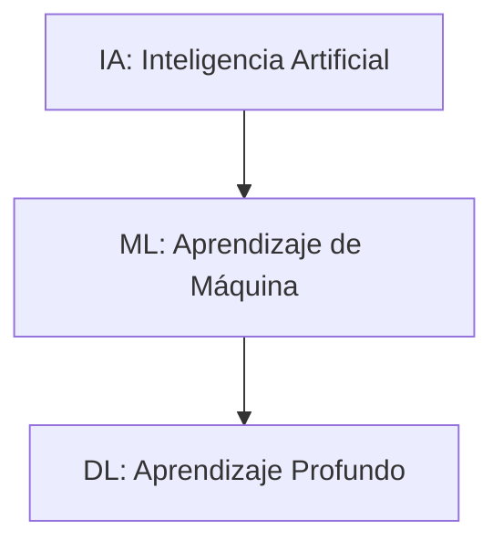
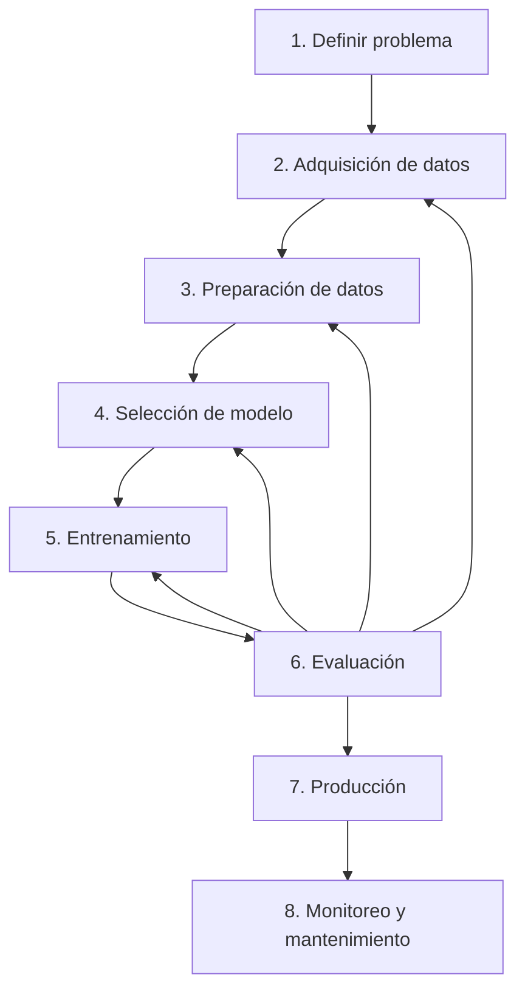

[Inicio](../index)

# Coceptos y flujo de aprendizaje de máquina  

## Inteligencia Artificial: Diferencias

La **Inteligencia Artificial (IA)** es una rama de la informática que se enfoca en crear sistemas capaces de realizar tareas que normalmente requieren inteligencia humana, como el razonamiento, la percepción, el procesamiento del lenguaje natural o la toma de decisiones.
> **IA = Sistema que emula comportamientos inteligentes.**

El **aprendizaje de máquina (ML)** es un subconjunto de la IA que permite a las máquinas aprender a partir de datos, identificar patrones y tomar decisiones sin ser explícitamente programadas para cada tarea específica.
> **ML = Sistemas que aprenden patrones a partir de datos.**

El **aprendizaje profundo (DL)** es una subcategoría del aprendizaje de máquina que utiliza redes neuronales profundas para aprender representaciones de datos jerárquicas. Es particularmente eficaz en el procesamiento de imágenes, sonido y lenguaje.
> **DL = ML + Redes Neuronales Profundas.**

## Tipos de aprendizajes de máquina

### Aprendizaje Supervisado

En este tipo de aprendizaje, el modelo se entrena con un conjunto de datos etiquetado, es decir, cada entrada tiene una salida conocida. 
El objetivo es que el modelo aprenda una función que relacione entradas con salidas.

**Ejemplo:**
El ejemplo de la **clasificación de correos como “spam” o “no spam”** es un caso de **aprendizaje supervisado** porque el algoritmo se entrena con un conjunto de datos previamente etiquetados por humanos. Es decir, cada correo ya tiene una etiqueta asignada (“spam” o “no spam”), lo cual sirve como **respuesta correcta** durante el entrenamiento. El modelo aprende a reconocer patrones en las características del correo (palabras usadas, remitente, frecuencia de enlaces, etc.) y a relacionarlos con la etiqueta correspondiente. Una vez entrenado, el sistema puede recibir un **nuevo correo sin etiqueta** y predecir si pertenece a la clase “spam” o “no spam”. En mecatrónica, esta lógica es similar a cuando entrenamos un sistema con datos de sensores previamente clasificados para que luego pueda reconocer estados o fallas automáticamente. ✅

**Ecuación básica:**

$$
y = f(\mathbf{x})
$$

donde:

* \$\mathbf{x}\$ representa las características de entrada
* \$y\$ es la salida etiquetada

El objetivo es encontrar \$\hat{f}\$ tal que \$\hat{f}(\mathbf{x}) \approx y\$ para nuevos ejemplos.

### Aprendizaje No Supervisado

Aquí, el modelo trabaja con datos sin etiquetar. 
El objetivo es identificar patrones o estructuras ocultas en los datos.

**Ejemplo:**
El **agrupamiento de clientes según sus hábitos de consumo** es un caso de **aprendizaje no supervisado** porque los datos no tienen etiquetas previas que indiquen a qué grupo pertenece cada cliente. El algoritmo analiza las características disponibles (por ejemplo, frecuencia de compra, monto gastado, tipo de productos adquiridos) y detecta **patrones ocultos** que permiten formar grupos o clústeres con comportamientos similares. Nadie le dice al sistema cuántos grupos habrá o cómo deben llamarse; el modelo los descubre automáticamente. En mecatrónica esto se relaciona con procesos como el análisis de señales de sensores, donde el sistema puede encontrar similitudes o anomalías sin que un humano le indique de antemano cuál es el “estado correcto”, ayudando a identificar patrones de operación o posibles fallas.

**Algoritmos comunes:** K-means, PCA, DBSCAN.

### Aprendizaje por Refuerzo

El agente aprende a tomar decisiones mediante prueba y error. 
Se recibe una recompensa por cada acción tomada y el objetivo es maximizar la recompensa acumulada a lo largo del tiempo.

**Ejemplo:**
El ejemplo de **un robot que aprende a caminar** corresponde al **aprendizaje por refuerzo** porque el sistema no recibe ejemplos correctos de cómo debe mover sus articulaciones, sino que aprende mediante **prueba y error**. El robot ejecuta acciones (mover una pierna, inclinarse, dar un paso) y el entorno le da una **retroalimentación** en forma de recompensas o penalizaciones: avanza sin caerse (recompensa positiva) o pierde el equilibrio (penalización). Con el tiempo, el robot ajusta su estrategia para maximizar la recompensa acumulada, desarrollando un comportamiento óptimo. En mecatrónica, este enfoque es muy útil en robótica autónoma, ya que permite a los sistemas aprender tareas complejas sin requerir un modelo matemático exacto del entorno, sino adaptándose dinámicamente a él.

**Ecuación del valor esperado de recompensa:**

$$
V(S) = \mathbb{E}\left[\sum_{t=0}^{\infty} \gamma^t r_t \right]
$$

donde:

* \$V(S)\$ es el valor del estado \$S\$
* \$\gamma\$ es el factor de descuento
* \$r\_t\$ es la recompensa en el tiempo \$t\$

### Comparación

| Tipo de aprendizaje | Datos etiquetados | Objetivo principal       | Ejemplo práctico              |
| ------------------- | ----------------- | ------------------------ | ----------------------------- |
| Supervisado         | Sí                | Predicción               | Clasificación de correos      |
| No supervisado      | No                | Descubrir patrones       | Agrupamiento de clientes      |
| Por refuerzo        | No (recompensas)  | Aprender política óptima | Agentes de videojuegos        |

## Flujo del aprendizaje de máquina  

### Flujo

El ciclo de vida de un proyecto de aprendizaje de máquina (ML lifecycle) es la hoja de ruta que guía desde la **definición del problema** hasta el **monitoreo** y **mantenimiento** en producción. Comprenderlo permite planificar con rigor, asignar tiempos, recursos y anticipar riesgos.  

### Etapas en detalle

| Etapa                            | Objetivo principal                                                                             | Salida típica                               |
| -------------------------------- | ---------------------------------------------------------------------------------------------- | ------------------------------------------- |
| **1. Definir problema**          | Traducir la necesidad de negocio en un objetivo cuantificable de ML.                           | Especificaciones: tipo de modelo, métrica   |
| **2. Adquisición de datos**      | Identificar y adquirir las fuentes de datos: bases, APIs, sensores, etc.                       | Datos crudos (raw data)                     |
| **3. Preparación de datos**      | Limpieza, normalización, ingeniería de características (feature engineering).                  | Conjuntos de entrenamiento/prueba           |
| **4. Selección de modelo**       | Elegir familia de algoritmos (regresión, clasificación, clustering…).                          | Modelo(es) candidato(s)                     |
| **5. Entrenamiento**             | Ajustar parámetros del modelo minimizando la función de costo.                                 | Modelo entrenado                            |
| **6. Evaluación**                | Medir desempeño según métricas (MSE, precisión, recall, F1, AUC…).                             | Reporte de métricas                         |
| **7. Producción**                | Integrar el modelo en un sistema para producción: APIs, contenedores, dispositivos embebidos.  | Servicio/endpoint activo                    |
| **8. Monitoreo y mantenimiento** | Supervisar calidad de predicciones, detectar desvíos (drift) y reentrenar según sea necesario. | Manual de operación, pipeline de retraining |

## Representación de datos (Matriz de características)

Matemáticamente los datos que utiliza una máquina de aprendizaje son:

$$
\mathbf{X} = 
\begin{pmatrix}
  x_{11} & x_{12} & \cdots & x_{1p} \\
  x_{21} & x_{22} & \cdots & x_{2p} \\
  \vdots & \vdots & \ddots & \vdots \\
  x_{n1} & x_{n2} & \cdots & x_{np}
\end{pmatrix},\quad
\mathbf{y} = 
\begin{pmatrix}
  y_1 \\ y_2 \\ \vdots \\ y_n
\end{pmatrix}.
$$

Donde:
    - **$n$**: Número de **muestras** u observaciones. Cada fila de $\mathbf{X}$ y cada entrada de $\mathbf{y}$ corresponde a una muestra distinta.  
    - **$p$**: Número de **características** o variables independientes. Cada columna de $\mathbf{X}$ representa una característica distinta.  
    - **$x_{ij}$**: Valor de la **característica** $j$ de la **muestra** $i$. Corresponde al elemento en la fila $i$, columna $j$ de la matriz $\mathbf{X}$.  
    - **$\mathbf{X}$**: Matriz de características de dimensión $n \times p$, que agrupa todos los $x_{ij}$.  
    - **$\mathbf{y}$**: Vector columna de valores **objetivo** de dimensión $n$, donde cada $y_i$ es la respuesta real asociada a la muestra $i$.  

