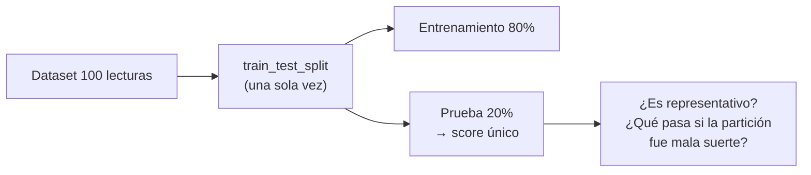
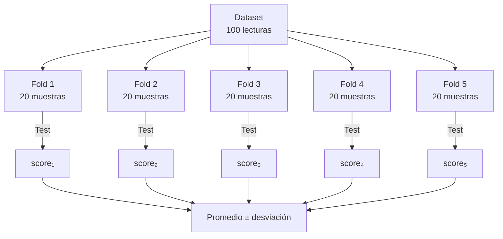

[Inicio](/curso/ia)

# Evaluación de Modelos: Validación cruzada

## Objetivo

Que los estudiantes comprendan el problema de evaluar modelos con los mismos datos de entrenamiento y apliquen **validación cruzada K-Fold** para obtener estimaciones confiables del desempeño, usando datos reales generados con Arduino Nano y sensores físicos.

## Aportación a los Atributos de Egreso

Esta actividad contribuye al **Atributo de Egreso 2 Nivel Avanzado (AE2A)** al permitir que los estudiantes evalúen de forma robusta modelos de IA implementados sobre datos provenientes de un sistema embebido real. Asimismo, fortalece el **Atributo de Egreso 7 Nivel Avanzado (AE7A)** porque los equipos discuten, planifican la partición de datos y analizan en conjunto la variabilidad entre folds.

## Método de enseñanza

* **Aprendizaje Experiencial** — los estudiantes generan y evalúan datos reales del circuito
* **Aprendizaje Colaborativo** — equipos comparan resultados entre folds y discuten variabilidad
* **Gamificación** — actividad final de 5–10 minutos

## Criterios de evaluación

| Criterio | Descripción | Puntaje |
|---|---|---|
| Recolección y etiquetado de datos | CSV con datos reales del circuito | 20% |
| Implementación de K-Fold en Python | Código funcional con sklearn | 40% |
| Interpretación de resultados | Explica variabilidad entre folds y elige métrica final | 20% |
| Entregables (Google Docs) | Evidencias de circuito, código y resultados | 20% |

---

# Desarrollo del tema

## 1. Aplicación ejemplo

**Aplicación: Sistema de monitoreo de condiciones ambientales en un corredor industrial automatizado.**

Se retoma el mismo sistema de los temas anteriores: un Arduino Nano con sensor de temperatura **LM35** y fotoresistencia **LDR** que clasifica si el ambiente está en *condición normal* o *condición crítica*. En esta clase el enfoque no es el modelo en sí, sino *cómo evaluarlo correctamente*: si usamos los mismos datos para entrenar y medir el desempeño, no sabemos si el modelo aprendió o simplemente memorizó. Con solo ~100 lecturas del circuito, una sola partición aleatoria puede ser engañosa; la validación cruzada nos da una estimación más estable.

**Circuito (mismo que la clase anterior):**

* Arduino Nano
* **LM35** → A0
* **LDR** + resistencia 10 kΩ → A1
* **LED rojo** (alerta) → D4
* **Buzzer** → D5

---

## 2. Conceptos

### 2.1 El problema de evaluar en los mismos datos

Si entrenas un modelo con 100 lecturas y lo evalúas con esas mismas 100 lecturas, el modelo puede memorizar los datos y reportar 100 % de accuracy sin haber aprendido nada útil. La solución inmediata es `train_test_split`, pero esa es una sola muestra aleatoria: si esa partición es atípica, el resultado no es confiable.



---

### 2.2 Validación cruzada K-Fold

En K-Fold Cross-Validation el dataset se divide en $K$ partes iguales llamadas **folds**. El modelo se entrena y evalúa $K$ veces: en cada iteración usa $K-1$ folds para entrenar y el fold restante para probar. El desempeño final es el promedio de los $K$ resultados.

$$
CV_K = \frac{1}{K} \sum_{k=1}^{K} \text{score}_k
$$

* $K$: número de folds (típicamente 5 o 10)
* $\text{score}_k$: métrica del modelo evaluada en el fold $k$ (accuracy, F1, MAE, etc.)



**Relación con la aplicación:**
Con ~100 lecturas del LM35 y LDR, un único split puede entregar resultados muy distintos según la partición. K=5 nos da cinco mediciones independientes del mismo clasificador y podemos ver cuánto varía el score; si varía mucho, el modelo es inestable.

---

### 2.3 ¿Cuántos folds usar?

| K | Ventaja | Desventaja |
|---|---|---|
| 5 | Rápido, buen balance para datasets pequeños | Mayor sesgo que K=10 |
| 10 | Estimación más precisa | Más tiempo de cómputo |
| N (LOO) | Usa todos los datos posibles | Muy lento en datasets grandes |

Para datasets pequeños como los generados en clase (< 200 muestras), **K = 5** es un buen balance.

---

### 2.4 Stratified K-Fold

Cuando las clases están desbalanceadas (por ejemplo, 80 lecturas normales y 20 críticas), un K-Fold aleatorio puede generar folds donde casi no hay ejemplos de la clase minoritaria. **Stratified K-Fold** garantiza que cada fold conserve la misma proporción de clases que el dataset original.

| Técnica | Cuándo usarla |
|---|---|
| `KFold` | Clases balanceadas o regresión |
| `StratifiedKFold` | Clases desbalanceadas (recomendado en clase) |

**Relación con la aplicación:**
Si solo simulamos condiciones críticas ocasionalmente (tapar el LDR, calentar el LM35), las clases quedarán desbalanceadas. `StratifiedKFold` asegura que todos los folds tengan ejemplos de ambas condiciones.

---

## 3. Ejercicio integrador

### Actividad

Recolectar un nuevo dataset con el circuito (o usar el de la clase anterior) y aplicar K-Fold Cross-Validation con K=5 para evaluar un clasificador de condición crítica.

---

### Código Arduino

```cpp
/*
  Recolección de datos: LM35 (A0), LDR (A1)
  Mismo circuito que la clase de métricas
*/
void setup() {
  Serial.begin(9600);
}

void loop() {
  int rawTemp  = analogRead(A0);
  int rawLight = analogRead(A1);

  // Convertir rawTemp a °C (pseudocódigo — ya lo vieron)
  // float tempC = ...

  Serial.print(rawTemp);
  Serial.print(",");
  Serial.println(rawLight);

  // delay(...)
}
```

---

### Código Python

```python
"""
Validación cruzada K-Fold para clasificación de condición ambiental
"""

import pandas as pd
from sklearn.linear_model import LogisticRegression
from sklearn.model_selection import StratifiedKFold, cross_val_score

# 1. Cargar datos (pseudocódigo — ya lo vieron)
# df = pd.read_csv("lecturas_clase.csv", names=["temp", "luz", "label"])

# 2. Separar features y etiquetas
# X = df[["temp", "luz"]]
# y = df["label"]

# 3. Definir modelo y validación cruzada
modelo = LogisticRegression()
kf = StratifiedKFold(n_splits=5, shuffle=True, random_state=42)

# 4. Calcular scores por fold
# scores_acc = cross_val_score(modelo, X, y, cv=kf, scoring="accuracy")
# scores_f1  = cross_val_score(modelo, X, y, cv=kf, scoring="f1")

# 5. Mostrar resultado por fold y promedio
# for i, (acc, f1) in enumerate(zip(scores_acc, scores_f1), 1):
#     print(f"Fold {i}: Accuracy={acc:.3f}  F1={f1:.3f}")

# print(f"\nAccuracy promedio : {scores_acc.mean():.3f} ± {scores_acc.std():.3f}")
# print(f"F1 promedio       : {scores_f1.mean():.3f} ± {scores_f1.std():.3f}")
```

---

# Entregables

Un **Google Docs** con:

1. Foto del circuito y CSV con los datos recolectados.
2. Código Arduino y Python ejecutados.
3. Tabla con el score de cada fold y el promedio ± desviación estándar.
4. Reflexión breve (5 líneas): ¿por qué el score varía entre folds y qué indica esa variación sobre la estabilidad del modelo?

---

# Actividad de gamificación (5–10 minutos)

### **Título:** "¿En qué fold estoy?"

### Dinámica

1. Proyectar en el pizarrón la tabla de 10 muestras (abajo).
2. Cada equipo de 3–4 estudiantes debe escribir en papel qué muestras van en el fold de **prueba** en cada una de las 5 iteraciones.
3. El primer equipo en completar correctamente las 5 iteraciones gana.
4. Bonus: ¿cuántas veces se usa cada muestra para **entrenar**?

### Tabla para proyectar

| Muestra | Clase |
|---|---|
| 1 | Normal |
| 2 | Crítico |
| 3 | Normal |
| 4 | Normal |
| 5 | Crítico |
| 6 | Normal |
| 7 | Normal |
| 8 | Crítico |
| 9 | Normal |
| 10 | Normal |

### Respuesta esperada (solo para el profesor)

Con K=5 y 10 muestras, cada fold tiene 2 muestras de prueba:

| Iteración | Fold de prueba | Folds de entrenamiento |
|---|---|---|
| 1 | 1, 2 | 3–10 |
| 2 | 3, 4 | 1–2, 5–10 |
| 3 | 5, 6 | 1–4, 7–10 |
| 4 | 7, 8 | 1–6, 9–10 |
| 5 | 9, 10 | 1–8 |

Cada muestra se usa **4 veces** para entrenar y **1 vez** para probar.

**Objetivo:** visualizar físicamente la rotación de folds y entender por qué K-Fold es más robusto que un solo split.
